<div align="center">



</div>

---

<div align="center">

<!-- LIVE STATUS BADGES -->
[](https://github.com/Samuel-AI-Electronic-Engineer)
[](https://github.com/Samuel-AI-Electronic-Engineer)
[](https://github.com/Samuel-AI-Electronic-Engineer)
[](https://github.com/Samuel-AI-Electronic-Engineer)

</div>

---

<!-- ═══════════════════════════════════════════════════════════════════ -->
<!-- SECTION 2 · MISSION CONTROL INTRODUCTION                          -->
<!-- ═══════════════════════════════════════════════════════════════════ -->

<div align="center">

```
╔═══════════════════════════════════════════════════════════════════╗
║              MISSION CONTROL — ENGINEER BRIEFING                  ║
║                     CLASSIFICATION: PUBLIC                        ║
╚═══════════════════════════════════════════════════════════════════╝
```

</div>

<table>
<tr>
<td width="68%" valign="top">

### `> SYSTEM INITIALIZATION`

**Electronic Engineer** specialized in the convergence of **Artificial Intelligence**, **Automation**, and **IoT**. My engineering stack spans the full vertical: from bare-metal embedded firmware on Raspberry Pi up to production-grade AI pipelines powered by LangGraph, Gemini, and Claude in Google Cloud Platform.

I do not build demos. I design **intelligent systems** that operate on real hardware, process real data, and deliver measurable industrial value — bridging the physical world and AI-driven decision-making.

**Current operational mode:** Architecting multi-agent AI systems integrated with sensor networks and industrial automation flows.

```python
engineer = {
    "name"    : "Samuel Alarcón Hernández",
    "role"    : "AI & IoT Systems Builder",
    "base"    : "Colombia 🇨🇴",
    "languages": ["Spanish (Native)", "English (B1)"],
    "mission" : "Physical World × Artificial Intelligence",
    "status"  : "🟢 ONLINE — ACCEPTING MISSIONS"
}
```

</td>
<td width="32%" valign="top">

### `> SIGNAL METRICS`

[](https://github.com/Samuel-AI-Electronic-Engineer)


</td>
</tr>
</table>

---

<!-- ═══════════════════════════════════════════════════════════════════ -->
<!-- SECTION 3 · CURRENT MISSION                                       -->
<!-- ═══════════════════════════════════════════════════════════════════ -->

## `◈ ACTIVE MISSION`

<div align="center">

```
┌─────────────────────────────────────────────────────────────────────────┐
│  MISSION ID  : SA-CORE-001                              PRIORITY: HIGH  │
│  CODENAME    : INTELLIGENT SYSTEMS INITIATIVE                           │
│  SECTOR      : Industrial AI · IoT · Automation                         │
│  STATUS      : ████████████████████░░░░  82% IN PROGRESS               │
├─────────────────────────────────────────────────────────────────────────┤
│                                                                         │
│  OBJECTIVE                                                              │
│  ─────────────────────────────────────────────────────────────────     │
│  Build production-grade Intelligent Systems for real-world industrial   │
│  applications integrating AI inference, sensor data pipelines,          │
│  automation flows, and cloud-edge architectures.                        │
│                                                                         │
│  ACTIVE WORKSTREAMS                                                     │
│  ─────────────────────────────────────────────────────────────────     │
│  ◉  Multi-agent AI pipelines with LangGraph + Gemini                   │
│  ◉  IoT sensor networks on Raspberry Pi + GCP                          │
│  ◉  Computer Vision systems for inventory automation                   │
│  ◉  RAG architectures for industrial intelligence                      │
│  ○  Air quality prediction models (QUEUED)                             │
│  ○  Telecom analytics platform (QUEUED)                                │
│                                                                         │
│  TOOLS DEPLOYED                                                         │
│  ─────────────────────────────────────────────────────────────────     │
│  Python · LangGraph · Gemini · Claude Code · Docker · GCP · PostgreSQL │
│  Raspberry Pi · Linux · Telecommunications · Electronics               │
│                                                                         │
└─────────────────────────────────────────────────────────────────────────┘
```

</div>

---
## `◈ MISSION TROPHIES`

<div align="center">

[](https://github.com/Samuel-AI-Electronic-Engineer)

</div>

---

## `◈ TECHNOLOGY RADAR`

<div align="center">


**`[ CORE SYSTEMS ]`**


**`[ AI / ML STACK ]`**


**`[ CLOUD / INFRASTRUCTURE ]`**


</div>

<br>

<div align="center">

```
  PROFICIENCY RADAR
  ──────────────────────────────────────────────────────────────
  Python             ████████████████████████░  ★★★★★  EXPERT
  AI / LangGraph     ████████████████████░░░░░  ★★★★☆  ADVANCED
  Machine Learning   ██████████████████░░░░░░░  ★★★★☆  ADVANCED
  IoT / Raspberry Pi ████████████████████░░░░░  ★★★★☆  ADVANCED
  Docker / Linux     ██████████████████░░░░░░░  ★★★★☆  ADVANCED
  Electronics        █████████████████████░░░░  ★★★★★  EXPERT
  PostgreSQL         ████████████████░░░░░░░░░  ★★★☆☆  SOLID
  GCP                ████████████████░░░░░░░░░  ★★★☆☆  SOLID
  Telecom            █████████████████████░░░░  ★★★★☆  ADVANCED
  Deep Learning      ████████████████░░░░░░░░░  ★★★☆☆  GROWING
  ──────────────────────────────────────────────────────────────
```

</div>

---

<!-- ═══════════════════════════════════════════════════════════════════ -->
<!-- SECTION 5 · ENGINEERING DOMAINS                                    -->
<!-- ═══════════════════════════════════════════════════════════════════ -->

## `◈ ENGINEERING DOMAINS`

<div align="center">
<table>
<tr>

<td align="center" width="33%" valign="top">

```
╔═══════════════════════════╗
║   🤖  ARTIFICIAL          ║
║       INTELLIGENCE        ║
╠═══════════════════════════╣
║                           ║
║  Multi-agent systems      ║
║  RAG architectures        ║
║  LLM orchestration        ║
║  Computer Vision          ║
║  NLP pipelines            ║
║                           ║
║  LangGraph · Gemini       ║
║  Claude · Python          ║
╚═══════════════════════════╝
```

</td>

<td align="center" width="33%" valign="top">

```
╔═══════════════════════════╗
║   ⚙️  AUTOMATION           ║
║       ENGINEERING         ║
╠═══════════════════════════╣
║                           ║
║  Industrial workflows     ║
║  AI-driven pipelines      ║
║  Process optimization     ║
║  Event-driven systems     ║
║  Scheduling & triggers    ║
║                           ║
║  Python · Docker          ║
║  GCP · Linux              ║
╚═══════════════════════════╝
```

</td>

<td align="center" width="33%" valign="top">

```
╔═══════════════════════════╗
║   🌐  INTERNET OF         ║
║       THINGS (IoT)        ║
╠═══════════════════════════╣
║                           ║
║  Sensor integration       ║
║  Edge-cloud pipelines     ║
║  Real-time monitoring     ║
║  Data acquisition         ║
║  Remote actuation         ║
║                           ║
║  Raspberry Pi · MQTT      ║
║  GCP IoT · Python         ║
╚═══════════════════════════╝
```

</td>

</tr>
<tr>

<td align="center" width="33%" valign="top">

```
╔═══════════════════════════╗
║   🔧  EMBEDDED            ║
║       SYSTEMS             ║
╠═══════════════════════════╣
║                           ║
║  Microcontrollers         ║
║  Firmware design          ║
║  Hardware interfaces      ║
║  Signal processing        ║
║  PCB & circuits           ║
║                           ║
║  Raspberry Pi · C/C++     ║
║  Electronics · Python     ║
╚═══════════════════════════╝
```

</td>

<td align="center" width="33%" valign="top">

```
╔═══════════════════════════╗
║   📡  TELECOM-            ║
║       MUNICATIONS         ║
╠═══════════════════════════╣
║                           ║
║  RF systems               ║
║  Network protocols        ║
║  Signal analysis          ║
║  Connectivity design      ║
║  Infrastructure mgmt      ║
║                           ║
║  RF · TCP/IP · MQTT       ║
║  Protocols · Networking   ║
╚═══════════════════════════╝
```

</td>

<td align="center" width="33%" valign="top">

```
╔═══════════════════════════╗
║   📊  DATA                ║
║       ANALYTICS           ║
╠═══════════════════════════╣
║                           ║
║  Sensor data pipelines    ║
║  Business intelligence    ║
║  Predictive modeling      ║
║  Time-series analysis     ║
║  Dashboard reporting      ║
║                           ║
║  Python · PostgreSQL      ║
║  Pandas · Matplotlib      ║
╚═══════════════════════════╝
```

</td>

</tr>
</table>
</div>

---

<!-- ═══════════════════════════════════════════════════════════════════ -->
<!-- SECTION 6 · FEATURED PROJECT                                       -->
<!-- ═══════════════════════════════════════════════════════════════════ -->

## `◈ FEATURED PROJECT`

<div align="center">

```
╔═══════════════════════════════════════════════════════════════════════════╗
║                                                                           ║
║    PROJECT ID  :  SA-PROJ-001                            FEATURED  ★★★   ║
║    CODENAME    :  SmartInventoryAI                                        ║
║    SECTOR      :  Industrial AI  ·  Computer Vision  ·  Automation        ║
║    STATUS      :  ██████████████████░░░░  ACTIVE DEVELOPMENT              ║
║                                                                           ║
╚═══════════════════════════════════════════════════════════════════════════╝
```

</div>

<table>
<tr>
<td width="50%" valign="top">

**`▸ PROBLEM`**

Industrial warehouses and retail operations lose millions yearly due to manual inventory errors: phantom stock, undetected discrepancies, slow cycle counts, and zero real-time visibility into stock levels. Traditional systems require constant human intervention and fail to predict shortfalls before they become operational crises.

**`▸ SOLUTION`**

SmartInventoryAI is an intelligent inventory management system that fuses **Computer Vision**, **Multi-Agent AI** (LangGraph), and **IoT sensor data** to automate detection, tracking, and prediction of inventory states — entirely removing the manual overhead from routine operations.

**`▸ ARCHITECTURE`**

```
[Camera Feed / IoT Sensors]
         │
         ▼
[Computer Vision Module]  ──→  Object Detection
         │                     Item Classification
         ▼
[LangGraph Agent Pipeline]
    │         │
    ▼         ▼
[Inventory  [Predictive
 Tracker]    Engine]
    │         │
    └────┬────┘
         ▼
[PostgreSQL + GCP Storage]
         │
         ▼
[Dashboard / Alerts / Reports]
```

</td>
<td width="50%" valign="top">

**`▸ BUSINESS VALUE`**

```
┌──────────────────────────────────────┐
│  OPERATIONAL METRICS                 │
├──────────────────────────────────────┤
│  Inventory accuracy     ↑ +97%       │
│  Manual counting time   ↓ -85%       │
│  Stock-out incidents    ↓ -70%       │
│  Operational costs      ↓ -40%       │
│  Real-time visibility   ✓ 24/7       │
└──────────────────────────────────────┘
```

**`▸ TECH STACK`**


**`▸ FUTURE VISION`**

- Autonomous drone-based scanning integration
- Multi-site federated AI inventory network
- Predictive procurement recommendations via LLM
- RFID + Vision sensor fusion layer
- Real-time supplier chain alerts

</td>
</tr>
</table>

---

<!-- ═══════════════════════════════════════════════════════════════════ -->
<!-- SECTION 7 · MISSION ROADMAP                                        -->
<!-- ═══════════════════════════════════════════════════════════════════ -->

## `◈ MISSION ROADMAP`

<div align="center">

```
MISSION TIMELINE — SYSTEMS UNDER DEVELOPMENT
══════════════════════════════════════════════════════════════════════════════

  ◉ SA-PROJ-001  SmartInventoryAI              [████████████████░░░░]  ACTIVE
  ──────────────────────────────────────────────────────────────────────────
  Computer Vision + LangGraph multi-agent system for intelligent
  inventory management, real-time stock tracking, and predictive alerts.
  Stack: Python · LangGraph · Gemini · OpenCV · PostgreSQL · Docker · GCP


  ◎ SA-PROJ-002  AirQualityPredictorAI         [██████░░░░░░░░░░░░░░]  QUEUED
  ──────────────────────────────────────────────────────────────────────────
  IoT sensor network + ML prediction pipeline for real-time air quality
  monitoring and forecasting in urban and industrial environments.
  Stack: Python · Raspberry Pi · IoT Sensors · ML Models · GCP · PostgreSQL


  ◎ SA-PROJ-003  SalesRAGAssistant             [████░░░░░░░░░░░░░░░░]  QUEUED
  ──────────────────────────────────────────────────────────────────────────
  Retrieval-Augmented Generation assistant for enterprise sales intelligence.
  LLM-powered Q&A over business data, contracts, and product catalogs.
  Stack: Python · LangGraph · Gemini · Claude · RAG · PostgreSQL · Docker


  ◎ SA-PROJ-004  TelecomInsightAI              [██░░░░░░░░░░░░░░░░░░]  PLANNED
  ──────────────────────────────────────────────────────────────────────────
  AI-powered telecom analytics platform for network performance monitoring,
  anomaly detection, and predictive maintenance of telecom infrastructure.
  Stack: Python · ML · Signal Processing · PostgreSQL · GCP · Visualization

══════════════════════════════════════════════════════════════════════════════
```

</div>

---

<!-- ═══════════════════════════════════════════════════════════════════ -->
<!-- SECTION 8 · CONTACT / CONNECT                                      -->
<!-- ═══════════════════════════════════════════════════════════════════ -->

## `◈ OPEN CHANNELS`

<div align="center">

```
╔══════════════════════════════════════════════════════════╗
║    COMMUNICATIONS PANEL — OPEN FOR CONTACT               ║
╠══════════════════════════════════════════════════════════╣
║                                                          ║
║  ◉  AI Systems collaboration                            ║
║  ◉  IoT & Automation projects                           ║
║  ◉  Industrial intelligence consulting                  ║
║  ◉  Technical research & development                    ║
║                                                          ║
╚══════════════════════════════════════════════════════════╝
```

[](https://www.linkedin.com/in/samuelalarcon-ai)
[](mailto:samuelalarcon2003@gmail.com)
[](https://github.com/Samuel-AI-Electronic-Engineer)

</div>

---

<div align="center">

```
╔══════════════════════════════════════════════════════════════════════════╗
║   "Where Electronics Meets Artificial Intelligence"                     ║
║                                                                          ║
║    Samuel Alarcón Hernández · Electronic Engineer · Colombia 🇨🇴         ║
║    AI Systems  ·  Automation  ·  IoT  ·  Embedded  ·  Telecommunications║
╚══════════════════════════════════════════════════════════════════════════╝
```


[](https://github.com/Samuel-AI-Electronic-Engineer)

*Last mission update: 2025 · Status: 🟢 ONLINE*

</div>
